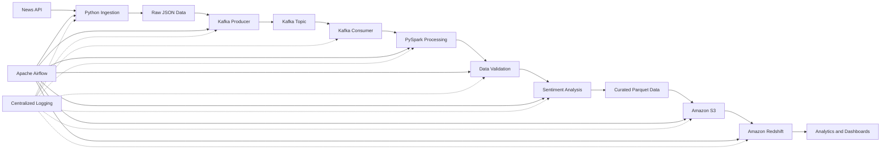

# Architecture Diagram

```mermaid
flowchart LR
    A[News API] --> B[Python Ingestion]
    B --> C[Raw JSON Data]
    C --> D[Kafka Producer]
    D --> E[Kafka Topic]
    E --> F[Kafka Consumer]
    F --> G[PySpark Processing]
    G --> H[Data Validation]
    H --> I[Sentiment Analysis]
    I --> J[Curated Parquet Data]
    J --> K[Amazon S3]
    K --> L[Amazon Redshift]
    L --> M[Analytics and Dashboards]

    N[Apache Airflow] --> B
    N --> D
    N --> G
    N --> H
    N --> I
    N --> K
    N --> L

    O[Centralized Logging] -.-> B
    O -.-> D
    O -.-> F
    O -.-> G
    O -.-> H
    O -.-> I
    O -.-> K
    O -.-> L
```
